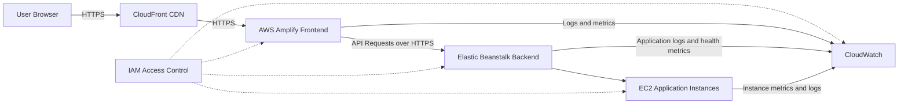

# TheVaultSentry AWS Infrastructure

AWS infrastructure documentation for **TheVaultSentry**, a cybersecurity-focused cloud engineering portfolio project. This repository documents a realistic deployment model for a web application using managed AWS services, CDN delivery, IAM-controlled access, and operational monitoring.

## Stack

- AWS Amplify for frontend hosting
- Elastic Beanstalk for backend application deployment
- EC2 as the compute layer managed by Elastic Beanstalk
- CloudFront for CDN delivery and HTTPS termination
- IAM for access control and service permissions
- CloudWatch for logs, metrics, and operational visibility

## Architecture

The application is designed around a simple managed AWS flow:



CloudFront provides a public CDN entry point and serves traffic over HTTPS. AWS Amplify hosts the frontend and routes backend API requests to the Elastic Beanstalk environment. Elastic Beanstalk manages the backend application environment and provisions EC2 instances for compute. CloudWatch centralizes logs and metrics for the frontend, backend, and underlying instances. IAM policies restrict access to deployment, runtime, and monitoring operations.

## Deployment Workflow

1. Frontend changes are deployed through AWS Amplify by connecting the application repository or uploading a build artifact.
2. Backend code is deployed to an Elastic Beanstalk environment using an application version bundle.
3. Elastic Beanstalk provisions and manages the EC2 environment required to run the backend.
4. CloudFront is configured in front of the application entry point to provide CDN caching and HTTPS access.
5. CloudWatch is used to review backend health, application logs, instance metrics, and deployment events.

## Security Considerations

- IAM access should follow least privilege for deployment users, service roles, and instance profiles.
- HTTPS should be enforced through CloudFront using an AWS Certificate Manager certificate.
- Backend endpoints should avoid exposing administrative routes or sensitive diagnostics publicly.
- CloudWatch log groups should be reviewed regularly and configured with appropriate retention periods.
- Secrets should not be committed to the repository or stored in plaintext deployment files.
- Elastic Beanstalk environment variables should be limited to required runtime configuration.
- CloudFront cache behavior should avoid caching sensitive API responses.

## Repository Structure

```text
thevaultsentry-aws-infrastructure/
+-- architecture/
|   +-- aws-architecture.mmd
+-- docs/
|   +-- deployment-notes.md
+-- screenshots/
+-- .gitignore
+-- README.md
```

## Security Review Summary

This setup is suitable for a portfolio-level AWS deployment, but the main risks are overly broad IAM permissions, insufficient log retention, weak separation between frontend and backend access, and incomplete alerting. The project should be reviewed for public backend exposure, CloudFront security headers, SSL enforcement, CloudWatch alarms, and deployment credentials with excessive permissions.
